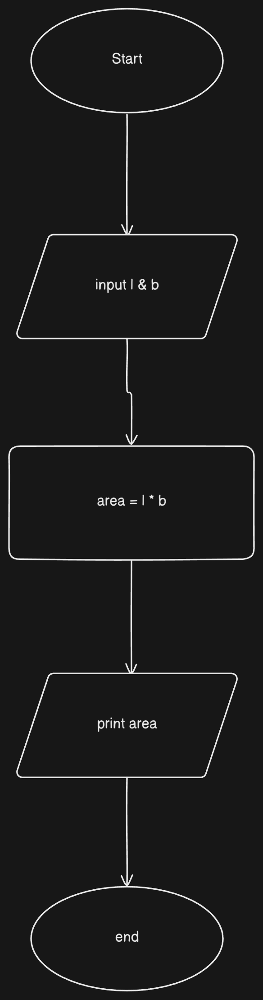
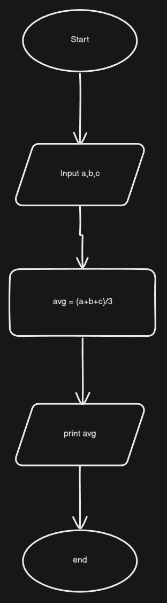
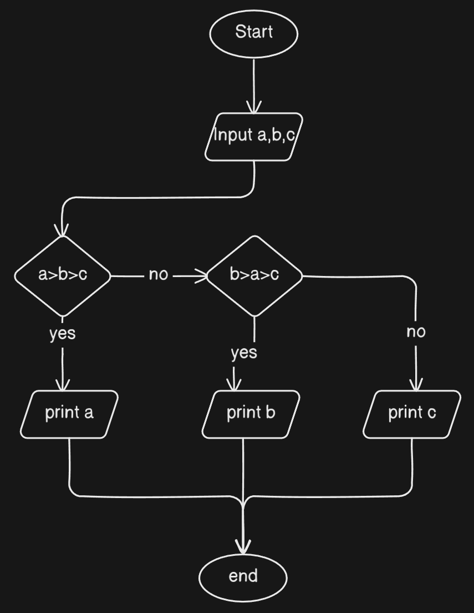
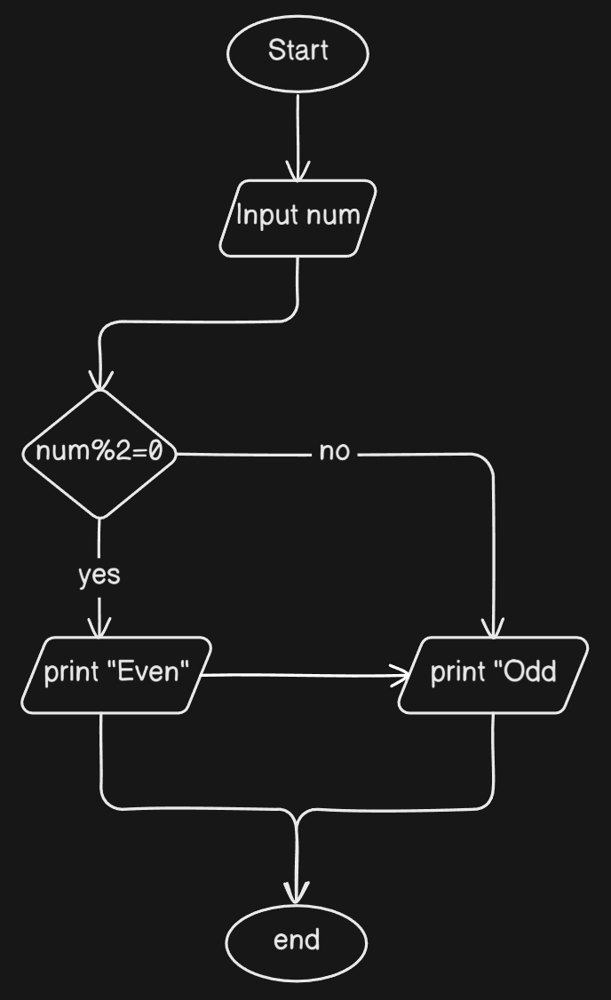
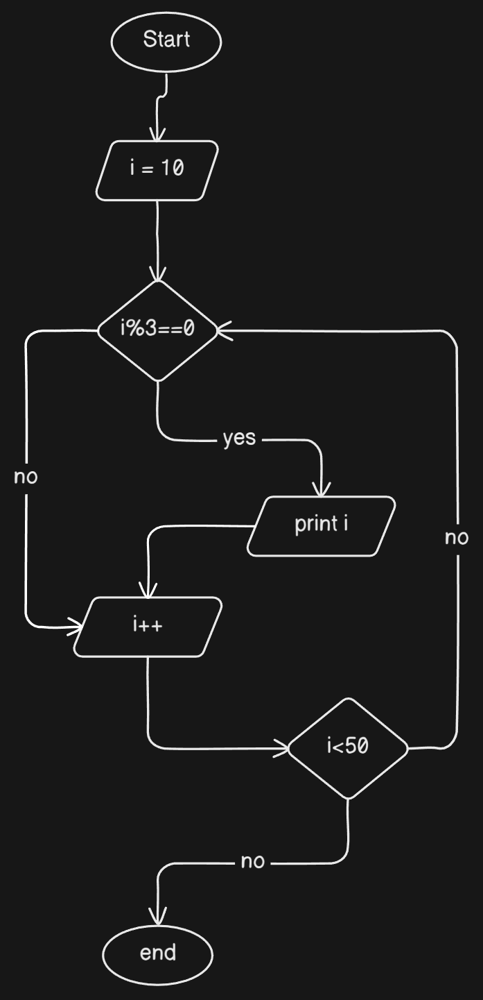

## Q1 - Flowchart and Pseudo code to calculate area of rectangle

```python
input l,b

area = l*b
print(area)

end
```



## Q2 - Calculate avg of three nums

```python
input a,b,c
avg = (a+b+c)/3
end
```



## Q3 - Largest of 3 numbers

```python
input a,b,c

if a>b>c
    print a
else if b>a>c
    print b
else
    print c

end
```



## Q4 - Even Odd num

```python
input num

if num % 2 == 0
    print "even"
else
    print "odd"

end

```



## Q5 - Multiple of 3 from 10 - 50

```python
i=10
for i <50
    if(i%3==0)
        print(i)

end
```


