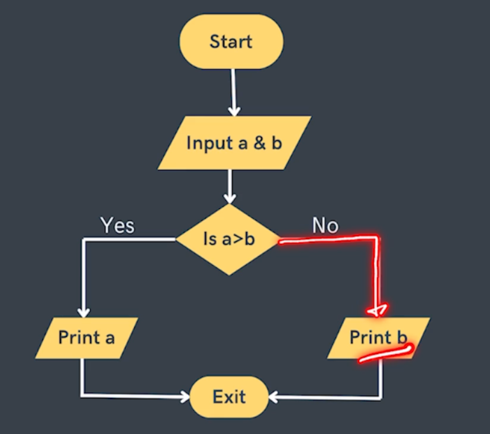

# Flow Chart

These are the diagrams to represent solution of a problem


## Components


## Sum of two numbers


## Print max of 2 nums



## Pseudo Code

```python
Input a and b
if a > b
    print a
else
    print b
exit
```

## Print first N natural numbers

```python
input n
init i=0
while i<n
    print i
    i = i+1
exit
```
